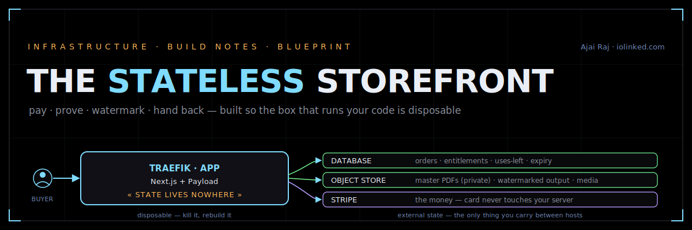

# The Stateless Storefront

<p align="center">
  
</p>

**How a website that takes a payment and hands back a watermarked file actually works — every component, why it's there, how the pieces talk, and the exact places it breaks.**

<p align="center">
  
  
  
  
</p>

> **▶ Read it live:** `https://ajairajofficial.github.io/Stateless_storefront`
> — or just open [`stateless-storefront-explainer.html`](stateless-storefront-explainer.html) in any browser. No build step, no dependencies.

```
                 ┌──────────────────────────────────────────┐
   buyer ──TLS──▶│  TRAEFIK · APP  (Next.js + Payload)       │──▶  DATABASE       orders · entitlements
                 │                                           │──▶  OBJECT STORE   master PDFs (private)
                 │            « STATE LIVES NOWHERE »         │──▶  STRIPE         the money, externalized
                 └──────────────────────────────────────────┘
                    disposable — kill it, rebuild it,              ^ the three stores you actually
                    point a fresh copy at the same three.            carry from one host to the next.
```

---

## Why I wrote this

I run a small digital-product shop on a Hostinger VPS. Standing up the first version was a weekend. The *real* lessons came after — the payment that got charged but never reached my code, the file someone found the raw URL of and shared in a Discord, the night I tried to move hosts and realized I wasn't sure where everything lived.

Every one of those was an **infrastructure** problem, not a feature problem. So I wrote down the wiring that makes them go away — the version I wish someone had handed me on day one. This repo is that document: one page, built from first principles, with the diagrams I'd draw on a whiteboard and the mistakes I actually made.

It's not a framework you install. It's a way of seeing the system so the next one you build is right the first time.

## Who this is for

- You can ship a side project, but the words **webhook**, **entitlement**, and **stateless** are still a little fuzzy.
- You've got a working store and a nagging feeling the download links aren't as locked as you'd like.
- You want to move off your current host someday without it being a frightening night.
- Or you just like seeing a system explained properly — the analogy *and* the failure mode, on the same page.

No prior knowledge assumed. Every term is defined the first time it appears.

## What you'll walk away understanding

By the end you'll be able to explain, out loud, without notes:

- **The one idea everything hangs on** — why pushing all state out of the app into three external services makes the whole thing easy to maintain *and* easy to move.
- **Why the webhook is the truth and the redirect is a lie** — and what happens to people who get that backwards.
- **How a watermark really works** — not a file you store, but a thing you do to a copy at the instant of download.
- **Why your card never touches your server** — and what that buys you in compliance terms.
- **The download gate as a state machine** — signed, expiring, use-limited tokens, and the race condition that quietly hands out free copies if you get the order of operations wrong.
- **What "moving servers" actually is** — four commands, because the box was disposable from the start.

And the part most tutorials skip: **ten concrete ways this breaks in production, and the one rule that prevents each.**


### A reading path

If you've got fifteen minutes, read in this order:

| Start here | Then | Then |
|---|---|---|
| The hero diagram + **Why this matters** | **The three Unlocks** (the misconceptions, flipped) | **The request flow** (one diagram, pay → stream) |
| **A real purchase, traced** (follow one $29 sale all the way) | **Where it breaks** (the failure table — screenshot this one) | **Field notes** (my actual install, and what bit me) |

## The stack it teaches

| Layer | Tool | Its one job |
|---|---|---|
| App (front + back + admin) | Next.js + Payload | one codebase, one deploy, nothing split |
| Data | SQLite → Postgres | orders, prices, **entitlements** (who · what · uses-left · expiry) |
| Files | S3-compatible (R2 / MinIO) | three stores: master PDFs (private), watermarked output, media |
| Payments | Stripe | hosted checkout + signed webhook; card never touches you |
| Download gate | signed tokens + pdf-lib | validate → decrement → stamp a copy → stream |
| Edge | Traefik | TLS, routing, IP allowlist, rate limit |
| Packaging | Docker Compose | the whole stack as one movable unit |
| Config | `.env` | secrets out of git; behavior set by environment |

You don't need any of these installed to read the page. It's an explainer, not a runtime.

## Field notes are included

The diagrams are the clean version. The repo also carries the messy truth — the five problems that cost me real hours getting this onto a live Hostinger box, and exactly what fixed each. Traefik refusing to see a host-network container. Certificates re-issuing into a rate limit. A first test sale that vanished on a rebuild. They're in the doc, written as war stories. Keep your own list as you go; it becomes the most useful page you own.


## Sources

The claims in the doc are grounded in primary docs, linked at the bottom of the page: Stripe (fulfillment, webhooks, PCI), Payload (database adapters), pdf-lib, Traefik (ACME/Let's Encrypt), and the twelve-factor method. No hand-waving.

---

Written and maintained by **Ajai Raj** · a product of [iolinked.com](https://iolinked.com)
